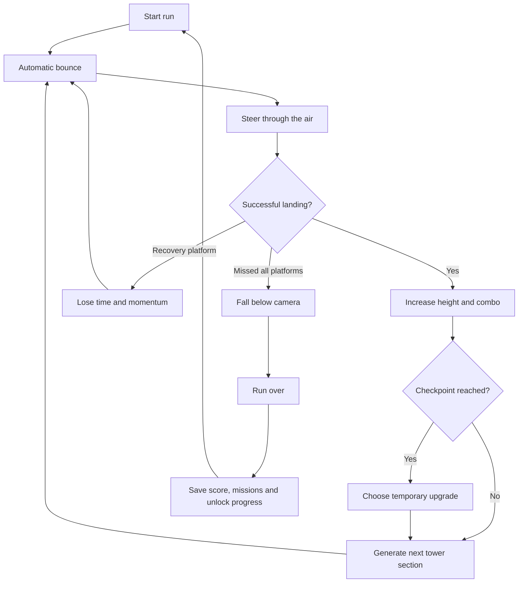
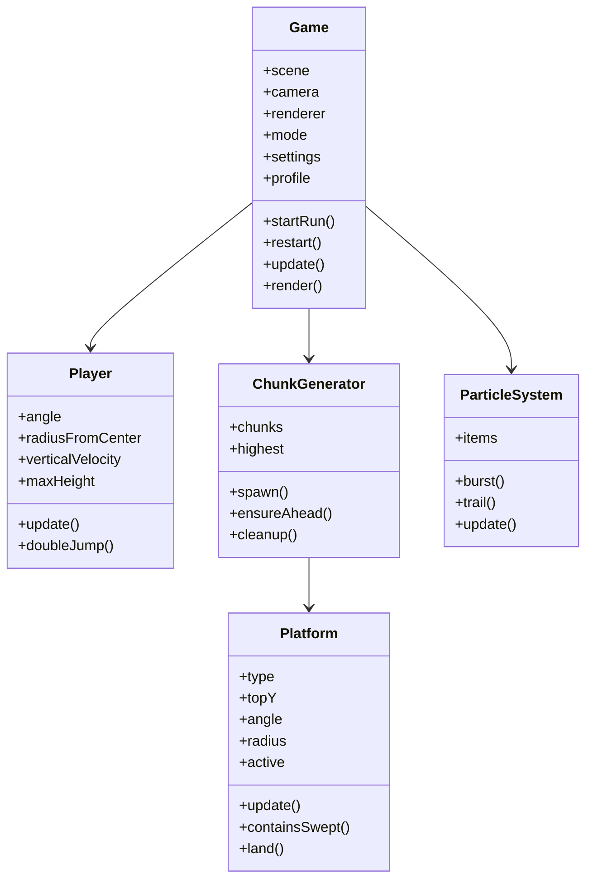

<p align="center">
  
</p>

<div align="center">

[](https://developer.mozilla.org/en-US/docs/Web/JavaScript)
[](https://threejs.org/)
[](https://developer.mozilla.org/en-US/docs/Web/HTML)
[](https://developer.mozilla.org/en-US/docs/Web/CSS)

[](#quick-start)
[](#technical-overview)
[](#browser-support)
[](#deploying-with-github-pages)

<br />


<br />

### A single-file 3D arcade platformer built with JavaScript and Three.js

Navigate an endlessly rising tower, control your trajectory in mid-air, survive unstable platforms and environmental hazards, collect crystals, complete missions, unlock cosmetics, and climb as high as possible.

[Play the game](https://thiepn.github.io/skyspire/) ·
[Report a bug](https://github.com/thiepn/skyspire/issues) ·
[Request a feature](https://github.com/thiepn/skyspire/issues)

</div>

---

## Table of contents

* [About the game](#about-the-game)
* [Gameplay overview](#gameplay-overview)
* [Main features](#main-features)
* [Controls](#controls)
* [Game modes](#game-modes)
* [Platform types](#platform-types)
* [Power-ups](#power-ups)
* [Hazards and enemies](#hazards-and-enemies)
* [Procedural generation](#procedural-generation)
* [Checkpoints and upgrades](#checkpoints-and-upgrades)
* [Scoring and progression](#scoring-and-progression)
* [Themes and environments](#themes-and-environments)
* [Missions](#missions)
* [Cosmetics and unlocks](#cosmetics-and-unlocks)
* [Settings](#settings)
* [Technical overview](#technical-overview)
* [Architecture](#architecture)
* [Quick start](#quick-start)
* [Working with VS Code](#working-with-vs-code)
* [Deploying with GitHub Pages](#deploying-with-github-pages)
* [Project structure](#project-structure)
* [Saved data](#saved-data)
* [Customization guide](#customization-guide)
* [Performance](#performance)
* [Browser support](#browser-support)
* [Troubleshooting](#troubleshooting)
* [Roadmap](#roadmap)
* [Contributing](#contributing)
* [License](#license)

---

# About the game

**Skyspire** is an endless 3D vertical platform-climbing game that runs directly in a modern web browser.

The player controls a small climber who automatically bounces whenever they land on a platform. Instead of manually pressing a jump button for every leap, the player focuses on controlling movement through the air, adjusting their angle around the tower, moving closer to or farther away from the tower wall, and choosing the safest or most rewarding route upward.

The entire world is built around a large cylindrical tower. Platforms are placed around its circumference and generated continuously as the player climbs. Older sections beneath the player are removed, while new sections are created above.

The result is an arcade-style loop built around:

* fast restarts
* increasingly difficult platform sequences
* procedural variation
* risk-versus-reward route choices
* collectible crystals
* persistent unlocks
* high-score chasing
* multiple game modes
* increasingly dangerous tower environments

> [!IMPORTANT]
> Skyspire is designed as a skill-based arcade game. Movement, landing accuracy, route selection, and recovery decisions matter more than permanent character upgrades.

---

# Gameplay overview

The objective is simple:

> **Climb as high as possible without falling below the camera or losing control of the route.**

The character automatically bounces when landing on a valid platform. During each bounce, the player adjusts the character’s movement around the tower and changes their radial position.

A typical run follows this loop:

1. Start on a safe introductory platform.
2. Automatically bounce toward the next platform.
3. Steer around the cylindrical tower using `A` and `D`.
4. Adjust distance from the tower using `W` and `S`.
5. Land on progressively higher platforms.
6. Collect crystals and temporary power-ups.
7. Avoid hazards, enemies, and unstable surfaces.
8. Reach checkpoint floors.
9. Select temporary run upgrades.
10. Continue into increasingly difficult tower sections.
11. Fall, complete the mode objective, or set a new personal record.
12. Restart immediately and attempt a better run.



---

# Main features

## Endless vertical climbing

The tower continues generating as the player rises. There is no fixed final floor in Endless mode.

## Automatic bouncing

Landing immediately launches the player upward again. This creates a continuous movement rhythm and keeps the focus on trajectory control.

## Cylindrical movement

Platforms are arranged around the outside of a central tower instead of along a flat left-to-right level.

## Procedural tower sections

The game assembles the tower from reusable chunk patterns such as spirals, alternating ledges, moving sequences, narrow bridges, risky forks, and vertical shafts.

## Thirteen platform behaviors

Platforms can remain static, move, collapse, rotate, disappear, tilt, split, bounce, slide the player, or imitate safe platforms before failing.

## Multiple game modes

Seven modes modify the objective, level generation, speed, platform sizes, recovery rules, or seed.

## Hazards and enemies

Higher sections introduce spikes, fire, lasers, wind, falling rocks, drones, guardians, turrets, and blockers.

## Power-ups

Temporary abilities can protect the player, slow the world, attract crystals, improve bounce height, reduce falling speed, or enable a double jump.

## Checkpoint upgrades

At major height intervals, the player enters a safe checkpoint and selects an upgrade for the current run.

## Persistent progression

Best height, settings, crystals, missions, unlocks, selected cosmetics, and customization choices are stored in the browser.

## Cosmetic shop

Crystals and mission rewards can unlock new character appearances, trails, landing effects, tower styles, platform styles, and starting effects.

## Five visual environments

The tower changes as the player climbs:

* Ancient
* Mechanical
* Crystal
* Sky Temple
* Void

## No installation or build process

The complete game is contained in one `index.html` file.

---

# Controls

## Keyboard controls

| Key      | Action                                      |
| -------- | ------------------------------------------- |
| `A`      | Move left around the tower                  |
| `D`      | Move right around the tower                 |
| `←`      | Move left around the tower                  |
| `→`      | Move right around the tower                 |
| `W`      | Move inward, toward the tower               |
| `S`      | Move outward, away from the tower           |
| `↑`      | Move inward                                 |
| `↓`      | Move outward                                |
| `Space`  | Use double jump when the power-up is active |
| `P`      | Pause or resume                             |
| `Escape` | Pause or resume                             |
| `R`      | Restart after a run                         |
| `Enter`  | Start or restart                            |
| `Space`  | Start or restart from menus                 |

> [!TIP]
> The character jumps automatically. Do not repeatedly press Space during ordinary movement. Space is only needed when the **Double Jump** power-up is active.

## Movement model

Skyspire uses two horizontal movement dimensions.

### Angular movement

`A` and `D` move the player around the circumference of the tower.

This is the primary method for aligning with platforms that appear to the left or right of the player.

### Radial movement

`W` and `S` adjust the player’s distance from the tower.

This is useful when:

* platforms sit closer to the tower wall
* a platform extends farther outward
* wind or tilting platforms push the character
* the player needs to correct a near miss

### Air control

The player retains directional influence while airborne. Movement accelerates gradually rather than changing instantly, allowing correction without making direction changes unrealistically sharp.

---

# Game modes

Skyspire contains seven modes.

## Endless

The standard Skyspire experience.

Climb until the player falls or is left behind by the rising camera.

**Objective:** Reach the greatest possible height.

---

## Time Trial

A fixed-height speed challenge.

**Objective:** Reach **200 metres** as quickly as possible.

The result is based on completion time rather than only maximum height.

---

## Daily Tower

Uses a date-based fixed seed.

All players receive the same generated tower layout for that day, making results more directly comparable.

**Objective:** Reach the highest point on the shared daily layout.

---

## Precision

Designed around accurate landings.

Changes include:

* smaller platforms
* slower camera pressure
* stronger perfect-landing bonuses
* more demanding route alignment

**Objective:** Prioritize controlled and centered landings.

---

## Rush

A faster and more aggressive version of the game.

Changes include:

* stronger bounce velocity
* faster camera pressure
* more unstable platform combinations
* fewer relaxed sections

**Objective:** Maintain momentum and react quickly.

---

## No Recovery

Removes most safety systems.

Changes include:

* no lower recovery platforms
* no automatic rescue behavior
* mistakes are more likely to end the run immediately

**Objective:** Climb cleanly without relying on recovery.

---

## Crystal Run

A collectible-focused challenge.

**Objective:** Collect **30 crystals before reaching 180 metres**.

The mode rewards route planning and risk-taking rather than only vertical speed.

---

# Platform types

Skyspire currently contains thirteen platform behaviors.

| Platform     | Behavior                                                                    |
| ------------ | --------------------------------------------------------------------------- |
| Static       | Remains fixed and permanently stable                                        |
| Moving       | Oscillates around the tower or radially                                     |
| Collapsing   | Shakes after landing and falls shortly afterward                            |
| Bounce       | Launches the player higher than an ordinary platform                        |
| Rotating     | Moves back and forth around the tower                                       |
| Disappearing | Alternates between active and inactive states                               |
| Conveyor     | Pushes the player around the tower                                          |
| Slippery     | Reduces movement friction and makes stopping harder                         |
| Tilting      | Tilts after landing and pushes the player outward                           |
| Elevator     | Moves vertically up and down                                                |
| Splitting    | Breaks into two falling pieces after activation                             |
| One-way      | Continually travels around the tower in one direction                       |
| Fake         | Looks mostly safe but collapses faster than an ordinary collapsing platform |

<details>
<summary><strong>Detailed platform behavior</strong></summary>

### Static platform

The basic platform type.

Static platforms provide:

* predictable landing areas
* introductory routes
* recovery opportunities
* spacing between more difficult mechanics

They remain stable until their entire tower chunk is removed beneath the player.

### Moving platform

A moving platform oscillates either:

* around the tower
* toward and away from the tower

Its motion is smooth and periodic. The player must predict where it will be when descending.

### Collapsing platform

A collapsing platform is initially safe.

After landing:

1. it begins shaking
2. a short warning period occurs
3. the platform falls
4. collision is disabled

The player normally has enough time for the automatic bounce to carry them away.

### Bounce platform

Bounce platforms are visually brighter and apply additional upward velocity.

They are useful for:

* reaching higher sections
* skipping intermediate height
* recovering momentum
* accessing riskier routes

### Rotating platform

A rotating platform changes its angular position around the tower in a predictable oscillating pattern.

The player must account for the platform’s current location and movement.

### Disappearing platform

These platforms repeatedly alternate between visible and invisible states.

Collision only works while the platform is active.

### Conveyor platform

A conveyor platform adds angular movement to the player.

The player can:

* move with the conveyor
* resist its movement
* use it to extend a jump

### Slippery platform

Slippery platforms reduce deceleration.

The player continues moving longer after directional input is released, making precise positioning more difficult.

### Tilting platform

After activation, the platform tilts and applies outward radial pressure.

The player must compensate by moving back toward the tower.

### Elevator platform

Elevator platforms move vertically.

Landing timing changes because both the player and platform may be moving along the vertical axis.

### Splitting platform

A splitting platform remains intact briefly after landing, then separates into two halves that fall away.

### One-way platform

Unlike an oscillating rotating platform, a one-way platform continually travels around the tower in one direction.

### Fake platform

A fake platform resembles a standard platform but gives only a shorter warning period before collapsing.

A subtle emissive pulse provides a visual clue.

</details>

---

# Power-ups

Temporary power-ups appear during runs.

## Double Jump

Grants one manual mid-air jump.

Press `Space` while airborne to activate it.

Useful for:

* correcting a missed trajectory
* recovering from wind
* reaching a higher platform
* escaping a bad route

## Shield

Absorbs one dangerous hit or failure event.

The shield is consumed after activation.

## Slow Time

Temporarily slows moving world elements while leaving player control responsive.

Affects systems such as:

* moving platforms
* rotating platforms
* collapse timing
* hazards
* enemies

## Crystal Magnet

Attracts nearby crystals toward the player.

This reduces the precision required to collect crystals but still requires choosing routes that pass reasonably close to them.

## High Bounce

Temporarily increases ordinary landing bounce height.

## Feather

Reduces gravity and slows falling speed.

This provides more time for air correction and makes difficult landings more forgiving.

---

# Hazards and enemies

As the tower difficulty increases, platforms may receive environmental hazards and enemy encounters.

## Hazards

### Spikes

Occupy dangerous areas of a platform and punish inaccurate landings.

### Fire vents

Activate in repeating cycles.

The player must pass while the vent is inactive.

### Lasers

Create timed danger zones around platforms or tower paths.

### Wind

Applies directional pressure to the character.

The player must actively compensate with movement controls.

### Falling rocks

Move downward through the tower and interfere with the climbing route.

---

## Enemies

### Drone

Travels near tower routes and acts as a moving collision hazard.

### Guardian

Patrols around a platform or tower section.

### Turret

Fires projectiles after a visible timing cycle.

### Blocker

Occupies part of a route and forces the player to adjust their landing position.

> [!NOTE]
> Enemies are designed as environmental obstacles rather than combat targets. Skyspire remains a movement-focused platformer.

---

# Procedural generation

The tower is not produced through unrestricted random platform placement.

Instead, the game uses reusable procedural chunks.

Each chunk contains a short arrangement of platforms and may represent patterns such as:

* spiral
* alternating ledges
* broken staircase
* moving sequence
* rotating sequence
* forked route
* vertical shaft
* narrow bridge

The generator controls:

* vertical spacing
* angular spacing
* platform dimensions
* platform type
* movement speed
* movement amplitude
* hazard probability
* enemy probability
* crystal placement
* power-up placement
* recovery platform placement
* checkpoint placement

## Generation flow

```mermaid
flowchart LR
    A[Read current height] --> B[Calculate difficulty]
    B --> C[Choose compatible chunk template]
    C --> D[Select platform types]
    D --> E[Place platforms around tower]
    E --> F[Add crystals and power-ups]
    F --> G[Add hazards and enemies]
    G --> H[Validate active route]
    H --> I[Spawn chunk above player]
    I --> J[Remove distant chunks below]
```



## Difficulty scaling

Difficulty increases mainly according to tower height.

Higher sections may contain:

* narrower platforms
* longer horizontal movement requirements
* more unstable platform types
* faster movement
* more hazards
* more enemy encounters
* fewer recovery surfaces
* stronger camera pressure
* more complex mechanic combinations

## Recovery platforms

In most modes, lower secondary platforms may appear beneath the intended route.

These platforms:

* prevent some minor errors from ending a run
* cost time
* reduce momentum
* often reset or weaken combo progress
* become less frequent at greater heights

No Recovery mode removes this safety system.

---

# Checkpoints and upgrades

A checkpoint appears approximately every **50 metres**.

Checkpoint platforms are:

* wider than ordinary platforms
* safer to land on
* visually distinct
* positioned between major tower environments

At a checkpoint, gameplay pauses and the player chooses a temporary run upgrade.

Possible upgrade categories include:

* increased bounce height
* improved air control
* increased crystal value
* slower camera pressure
* shield protection
* stronger movement assistance

Checkpoint upgrades apply only to the current run.

They reset when the player starts a new run.

---

# Scoring and progression

Skyspire tracks several categories during a run.

## Height

Maximum height is the primary performance measurement.

The value never decreases if the player temporarily falls to a lower platform.

## Crystals

Crystals contribute to:

* run score
* persistent wallet currency
* mission completion
* cosmetic unlocks

Riskier crystals can award additional score.

## Landing combo

Consecutive upward landings increase the combo counter.

The combo may reset when:

* the player lands significantly below previous progress
* a recovery action is used
* the run ends

## Perfect landing

Landing near the center of a platform awards a bonus.

## Risky landing

Landing near the edge can produce a smaller risk bonus.

## Platform multipliers

More dangerous platforms provide stronger score multipliers.

Examples include:

* moving platforms
* collapsing platforms
* rotating platforms
* disappearing platforms
* splitting platforms
* fake platforms

## Milestones

Major height achievements display progress notifications and may mark:

* personal records
* theme transitions
* checkpoint arrival
* mode objectives

---

# Themes and environments

The visual environment changes automatically according to height.

|   Height | Theme      | Visual direction                                   |
| -------: | ---------- | -------------------------------------------------- |
|    `0 m` | Ancient    | Stone, wood, warm accents and sky atmosphere       |
|   `50 m` | Mechanical | Darker metal, industrial colors and machinery      |
|  `100 m` | Crystal    | Purple-blue fog, glowing surfaces and cyan accents |
|  `150 m` | Sky Temple | Bright marble, clouds and gold details             |
| `200 m+` | Void       | Dark space, neon geometry and unstable atmosphere  |

Theme changes affect:

* background color
* fog
* tower material
* platform material
* accent colors
* atmosphere
* visual readability

The gameplay systems remain consistent while the presentation changes.

---

# Missions

Missions provide persistent crystal rewards.

Current missions include:

| Mission           | Requirement                          | Reward |
| ----------------- | ------------------------------------ | -----: |
| Reach 100 m       | Reach a maximum height of 100 metres |     40 |
| Crystal Collector | Collect 20 crystals in one run       |     50 |
| Moving Mastery    | Land on 10 moving platforms          |     45 |
| Combo Climber     | Reach a 15-landing combo             |     60 |
| Clean Checkpoint  | Reach a checkpoint without recovery  |     55 |

Mission completion is stored locally.

Completed missions remain completed between browser sessions.

---

# Cosmetics and unlocks

Skyspire includes a persistent cosmetic shop.

Cosmetics do not change collision dimensions or core game balance.

## Character skins

* Default Orb
* Sky Knight
* Climber Bot
* Crystal Being

## Trails

* No Trail
* Light Trail
* Fire Trail
* Crystal Trail
* Cloud Trail

## Landing effects

* Default landing effect
* Landing Ring
* Star Burst

## Tower styles

* Default tower
* Moss Tower
* Golden Tower
* Neon Tower

## Platform styles

* Classic
* Rune Platforms
* Glass Platforms

## Starting effects

* Default start
* Start Pulse
* Starfall Start

Crystals collected during runs and mission rewards are used to unlock cosmetics.

Selected cosmetics are saved automatically.

---

# Settings

Skyspire includes configurable graphics, accessibility, and control options.

## Graphics quality

Available presets:

* Low
* Medium
* High

## Shadows

Dynamic shadow rendering can be enabled or disabled.

Disabling shadows may improve performance on integrated graphics or older devices.

## Particle intensity

Available levels:

* Low
* Medium
* High

## Camera shake

Can be disabled for players who prefer a more stable presentation.

## Control sensitivity

Adjusts the responsiveness of angular and radial movement.

## Field of view

Can be adjusted between a narrower or wider camera perspective.

## Reduced motion

Reduces visual movement effects and camera intensity.

> [!TIP]
> For lower-powered laptops, use **Low graphics**, disable **Shadows**, and reduce **Particle intensity**.

---

# Technical overview

Skyspire uses:

* HTML5
* CSS3
* vanilla JavaScript
* Three.js `0.160.0`
* browser `localStorage`
* `requestAnimationFrame`
* custom arcade physics
* custom swept platform collision

The game does not require:

* Node.js
* npm
* React
* Vue
* TypeScript
* Webpack
* Vite
* a database
* a server
* user accounts
* external images
* external 3D models
* a physics engine

Three.js is loaded from a CDN:

```html
<script src="https://cdnjs.cloudflare.com/ajax/libs/three.js/0.160.0/three.min.js"></script>
```

Because Three.js is loaded remotely, the browser requires an internet connection unless the library is downloaded and hosted locally.

---

# Architecture

Although the entire game is stored in one HTML file, the JavaScript is divided into logical classes.

| Class            | Responsibility                                                  |
| ---------------- | --------------------------------------------------------------- |
| `RNG`            | Seeded pseudo-random generation                                 |
| `ParticleSystem` | Landing, crystal, debris, trail and effect particles            |
| `Crystal`        | Crystal rendering, collection and scoring                       |
| `PowerUp`        | Temporary ability pickups                                       |
| `Hazard`         | Platform hazard behavior                                        |
| `Enemy`          | Moving enemy obstacles                                          |
| `FallingRock`    | Falling environmental obstacles                                 |
| `Platform`       | Platform state, movement, collision bounds and special behavior |
| `Player`         | Input, movement, physics, visual model and landing aids         |
| `ChunkGenerator` | Procedural level generation and cleanup                         |
| `Game`           | Main state, rendering, UI, modes, scoring and persistence       |



---

# Quick start

## Option 1: Open the file directly

1. Download or clone the repository.
2. Locate `index.html`.
3. Open it in Chrome, Edge, or Firefox.

This may work immediately because the game has no module imports or local asset requests.

## Option 2: Use a local development server

Using a local server is recommended.

### VS Code Live Server

1. Install Visual Studio Code.
2. Install the **Live Server** extension.
3. Open the project folder.
4. Right-click `index.html`.
5. Select **Open with Live Server**.

The game will open at an address similar to:

```text
http://127.0.0.1:5500/
```

### Python local server

If Python is installed:

```bash
python -m http.server 8000
```

Then open:

```text
http://localhost:8000/
```

---

# Working with VS Code

## Clone the repository

```bash
git clone https://github.com/OWNER/REPOSITORY.git
cd REPOSITORY
code .
```

## Pull the newest changes

```bash
git pull
```

## Start editing

The complete game is inside:

```text
index.html
```

## Save and test

Use Live Server so changes reload automatically after saving.

## Commit changes

```bash
git status
git add .
git commit -m "Improve Skyspire gameplay"
git push
```

## Recommended branch workflow

```bash
git checkout -b feature/new-platform-type
```

After completing the feature:

```bash
git add .
git commit -m "Add new platform type"
git push -u origin feature/new-platform-type
```

Then create a pull request on GitHub.

---

# Deploying with GitHub Pages

Skyspire can be hosted directly through GitHub Pages.

## Deployment steps

1. Open the GitHub repository.
2. Select **Settings**.
3. Open **Pages**.
4. Under **Build and deployment**, choose:

   * **Source:** Deploy from a branch
   * **Branch:** `main`
   * **Folder:** `/root`
5. Save the settings.

The site should become available at:

```text
https://OWNER.github.io/REPOSITORY/
```

> [!NOTE]
> The repository must contain `index.html` in the selected deployment folder.

## Updating the live game

After GitHub Pages is enabled, push changes normally:

```bash
git add .
git commit -m "Update Skyspire"
git push
```

GitHub Pages will redeploy the updated version.

---

# Project structure

The minimal repository can remain extremely small:

```text
skyspire/
├── index.html
├── README.md
└── LICENSE
```

The current single-file implementation contains:

```text
index.html
├── HTML interface
├── CSS styling
├── Three.js CDN import
└── JavaScript game code
    ├── constants and configuration
    ├── procedural random generator
    ├── particle system
    ├── collectibles
    ├── power-ups
    ├── hazards
    ├── enemies
    ├── platform logic
    ├── player physics
    ├── chunk generation
    ├── camera system
    ├── scoring
    ├── missions
    ├── cosmetics
    ├── game modes
    ├── settings
    └── local persistence
```

---

# Saved data

Skyspire stores progress in browser `localStorage`.

Current keys include:

| Key                  | Purpose                                          |
| -------------------- | ------------------------------------------------ |
| `skyspireBestHeight` | Highest recorded climb                           |
| `skyspireSettings`   | Graphics, controls and accessibility settings    |
| `skyspireProfile`    | Wallet, missions, unlocks and selected cosmetics |

## Resetting saved progress

Open the browser developer console and run:

```javascript
localStorage.removeItem("skyspireBestHeight");
localStorage.removeItem("skyspireSettings");
localStorage.removeItem("skyspireProfile");
location.reload();
```

To clear all storage for the current site:

```javascript
localStorage.clear();
location.reload();
```

> [!WARNING]
> Clearing local storage permanently removes saved progress, mission completion, currency, settings and unlocks for that browser.

---

# Customization guide

Because the entire project is contained in one file, most systems can be found using VS Code search.

Press:

```text
Ctrl + F
```

or:

```text
Ctrl + Shift + F
```

## Change game modes

Search for:

```javascript
const MODES
```

Each mode contains:

* internal identifier
* display name
* description

## Change themes

Search for:

```javascript
const THEMES
```

Theme configuration includes:

* activation height
* background color
* fog color
* tower color
* platform color
* accent color

Example structure:

```javascript
{
  name: "Ancient",
  at: 0,
  bg: 0x89cbea,
  fog: 0xa8d9ec,
  tower: 0x65717d,
  stone: 0x8b9298,
  accent: 0xffd284
}
```

## Change cosmetic prices

Search for:

```javascript
const SHOP
```

Each item contains:

```javascript
{
  kind: "skin",
  id: "knight",
  name: "Sky Knight",
  cost: 100
}
```

## Change missions

Search for:

```javascript
const MISSIONS
```

Each mission defines:

* identifier
* display name
* reward
* completion condition
* progress text

## Change platform generation

Search for:

```javascript
chooseType
```

This controls which platform types become available at different difficulty levels.

## Change chunk templates

Search for:

```javascript
this.templates
```

The current generator includes patterns such as:

```javascript
[
  "spiral",
  "alternate",
  "stairs",
  "moving",
  "rotating",
  "fork",
  "shaft",
  "bridge"
]
```

## Change checkpoint spacing

Search for:

```javascript
nextCheckpoint
```

The default interval is approximately:

```javascript
50
```

## Change movement

Search within the `Player` class for:

* angular acceleration
* radial acceleration
* maximum angular speed
* radial speed
* gravity
* bounce velocity
* air control

## Change power-up frequency

Search for:

```javascript
maybeDecorate
```

This function controls probabilities for:

* crystals
* power-ups
* hazards
* enemies

> [!IMPORTANT]
> When changing jump height, movement speed, platform spacing, or platform width, test procedural generation carefully. These systems depend on one another.

---

# Performance

Skyspire is designed to run on ordinary laptop hardware.

Performance measures include:

* capped device pixel ratio
* simple low-poly geometry
* limited active particle count
* shared or lightweight geometry
* removal of distant tower chunks
* limited dynamic lights
* optional shadows
* adjustable graphics quality
* adjustable particle intensity
* no external textures
* no animated 3D models
* no full rigid-body physics engine

## Recommended settings

### Older or integrated graphics

* Graphics quality: Low
* Shadows: Off
* Particle intensity: Low
* Camera shake: Off

### Modern laptop

* Graphics quality: Medium
* Shadows: On
* Particle intensity: Medium or High

### Dedicated GPU

* Graphics quality: High
* Shadows: On
* Particle intensity: High

---

# Browser support

Recommended browsers:

* Google Chrome
* Microsoft Edge
* Mozilla Firefox
* Brave
* other modern Chromium-based browsers

The game requires:

* WebGL
* ES6 JavaScript support
* `requestAnimationFrame`
* browser local storage
* internet access for the Three.js CDN

## Unsupported or unreliable environments

The game may not function correctly in:

* very old browsers
* browsers with WebGL disabled
* restricted embedded webviews
* environments blocking the Three.js CDN
* devices with outdated graphics drivers

---

# Troubleshooting

<details>
<summary><strong>The page is blank</strong></summary>

Possible causes:

1. Three.js failed to load.
2. Internet access is unavailable.
3. The CDN is blocked.
4. WebGL is disabled.
5. A JavaScript error occurred.

Open browser developer tools with:

```text
F12
```

Then inspect the **Console** tab.

</details>

<details>
<summary><strong>The game works locally but not on GitHub Pages</strong></summary>

Check that:

* the file is named exactly `index.html`
* the file is in the deployed folder
* GitHub Pages uses the correct branch
* repository Pages deployment completed successfully
* the browser is not showing a cached older version

Try a hard refresh:

```text
Ctrl + F5
```

</details>

<details>
<summary><strong>Controls feel too sensitive</strong></summary>

Open **Settings** and reduce **Control sensitivity**.

You can also adjust movement constants inside the `Player` class.

</details>

<details>
<summary><strong>The game runs slowly</strong></summary>

Use:

* Low graphics quality
* Shadows off
* Low particle intensity
* Reduced motion
* a smaller browser window

Also close GPU-heavy browser tabs.

</details>

<details>
<summary><strong>Saved progress disappeared</strong></summary>

Progress is stored in browser local storage.

It may disappear when:

* browser data is cleared
* private browsing is used
* the game is opened under a different URL
* the GitHub Pages domain changes
* another browser or device is used

Progress is not currently synchronized online.

</details>

---

# Roadmap

Possible future improvements:

## Core gameplay

* improved collision debugging tools
* expanded procedural validation
* more landing feedback
* trajectory preview improvements
* additional tower chunk templates
* boss-like tower sections
* more advanced route branching

## Platform mechanics

* magnetic platforms
* orbiting ring platforms
* gravity-shifting platforms
* chained moving platform sequences
* breakable wall sections
* timed gates
* wall-bounce chambers

## Modes

* seeded challenge sharing
* weekly tower
* survival mode
* limited-movement challenge
* checkpoint speedrun
* endless crystal mode
* custom tower generator

## Progression

* achievements
* additional missions
* cosmetic rarity tiers
* unlock previews
* statistics history
* run history
* personal records by mode

## Social systems

* online leaderboard
* daily leaderboard
* shareable run seed
* replay data
* ghost runs

## Technical improvements

* split the single file into modules
* add automated browser testing
* add linting
* add a service worker
* add offline Three.js hosting
* add progressive web app support
* add mobile touch controls
* improve accessibility
* add controller support

> [!NOTE]
> The current single-file format is convenient for sharing and deployment. As the project becomes larger, splitting the code into modules would improve maintainability.

---

# Contributing

Contributions are welcome.

## Suggested contribution process

1. Fork the repository.
2. Create a feature branch.

```bash
git checkout -b feature/my-improvement
```

3. Make and test your changes.
4. Commit with a clear message.

```bash
git commit -m "Add improved checkpoint visuals"
```

5. Push the branch.

```bash
git push origin feature/my-improvement
```

6. Open a pull request.

## Before submitting

Verify that:

* the game starts correctly
* controls still work
* automatic bouncing works
* platforms remain reachable
* restart works repeatedly
* no additional animation loop is created
* local storage migration does not break
* the browser console shows no new errors
* GitHub Pages deployment still works

## Useful contribution areas

* procedural generation
* collision reliability
* visual effects
* accessibility
* performance
* new platform mechanics
* balancing
* code organization
* browser testing
* documentation

---

# License

No license is automatically granted merely by publishing a repository.

Choose and add a license before allowing broad reuse or redistribution.

Common options include:

* MIT License
* Apache License 2.0
* GNU General Public License v3.0

For a small open-source browser game, the MIT License is often the simplest option.

Create a file named:

```text
LICENSE
```

and place the full license text inside it.

---

# Credits

## Technology

* [Three.js](https://threejs.org/) for 3D rendering
* HTML5, CSS3 and vanilla JavaScript
* GitHub Pages for static hosting

## Visual README services

* [Shields.io](https://shields.io/) for badges
* [Capsule Render](https://github.com/kyechan99/capsule-render) for the animated header
* [Readme Typing SVG](https://github.com/DenverCoder1/readme-typing-svg) for animated text

---

<div align="center">

## Climb higher. Move cleaner. Break the record.


</div>
